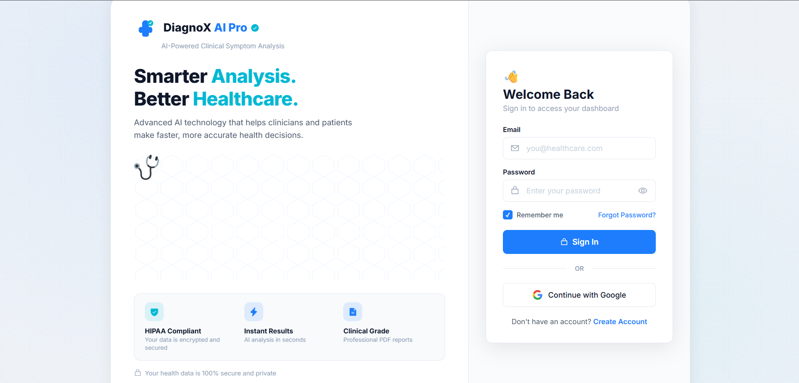
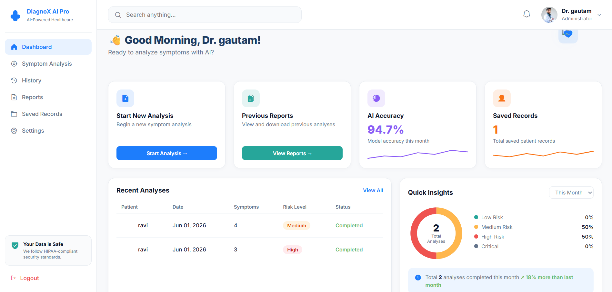
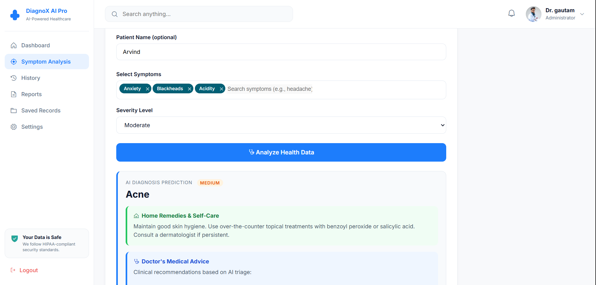

# DiagnoX AI Pro
An AI-powered healthcare platform for symptom analysis and differential diagnosis.

## 🗒️ Overview

DiagnoX AI Pro is an AI-driven healthcare platform designed to assist users and clinicians in performing symptom analysis and generating explainable differential diagnoses. The platform provides secure authentication, interactive dashboards, symptom categorization, severity assessment, and AI-powered clinical insights to improve decision-making and healthcare accessibility.

## 📸 Screenshots

<br/><br/>
<br/><br/>
<br/><br/>


## ✨ Features

- Secure Authentication: Login and signup system with protected access.
- Interactive Dashboard: Personalized dashboard with reports and analysis history.
- Symptom Analysis Engine: Select symptoms from multiple medical categories.
- Severity Assessment: Rate symptoms from mild to severe for better analysis.
- AI-Powered Diagnosis: Generates possible conditions with explainable insights.
- Results Dashboard: Displays confidence scores, recommendations, and risk indicators.
- Downloadable Reports: Generate reports for analysis results.

## 🚀 Getting Started

### Prerequisites

- Node.js
- MongoDB
- React.js
- Express.js
- Required packages listed in package.json

## 💻 Local Setup

Clone the repository:

```bash
git clone https://github.com/yourusername/DiagnoX-AI-Pro.git

cd DiagnoX-AI-Pro
```

Install backend dependencies:

```bash
cd backend

npm install

npm start
```

Install frontend dependencies:

```bash
cd frontend

npm install

npm start
```

Open:

```text
http://localhost:3000
```

## 🩺 Usage

- Create an account or login
- Access the dashboard
- Start symptom analysis
- Select symptoms and severity
- Run AI analysis
- View results and recommendations

## 🛠️ Technologies Used

- React.js
- Node.js
- Express.js
- MongoDB
- Authentication Systems
- AI / Machine Learning Integration
- Modern UI Frameworks

## 🙏 Acknowledgments

- Healthcare AI Research
- Open Source Community
- Modern Medical UI Design Principles
